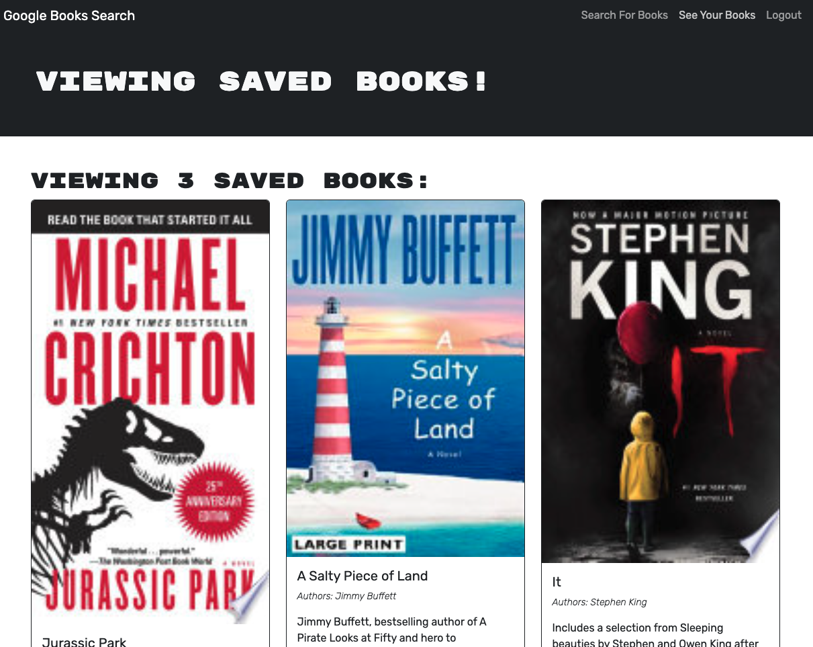

# Mern-Book-Search-Engine

## Description

THis application is a book search engine that allows the user to search for books and get information on the books as well as save them to a collection that is displayed on another page where the user can view and delete books from their collection.

## Technologies Used

This site was built using MongoDB and Mongoose, React, Apollo Client, JavaScript Web Tokens for user authentication

## Usage 

Click the link below to navigate to the site and browse books. You have to create an account to save books to your collection!

## Link to Deployed Site

[Google Book Search](https://shielded-castle-59542-c839354887e1.herokuapp.com/)

## Screenshot

